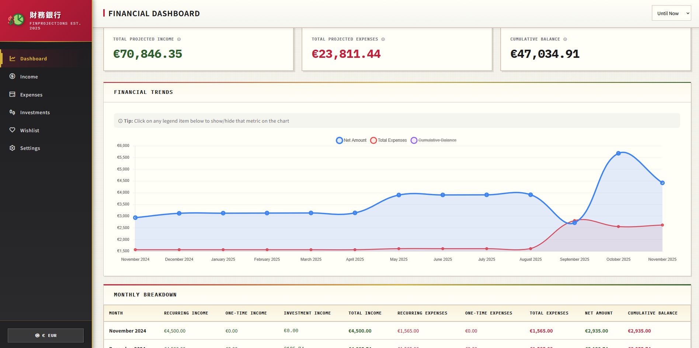
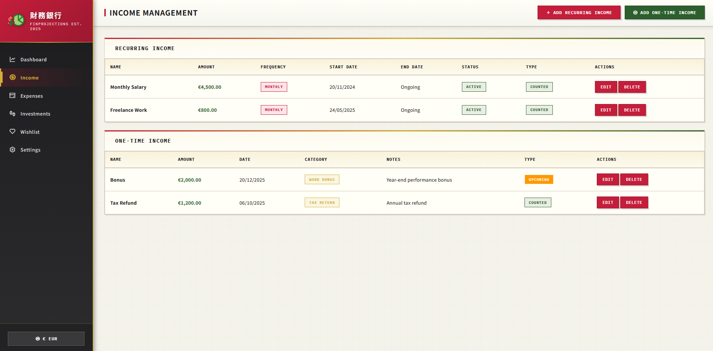

# FinProjections

Flask-based budgeting app for income and expenses tracking

## Screenshots

### Dashboard


### Income Management


## Installation

### Prerequisites
- Python 3.8 or higher
- pip (Python package manager)

### Setup Instructions

1. **Clone or download this repository**
   ```bash
   cd FinProjections
   ```

2. **Create a virtual environment (recommended)**
   ```bash
   python -m venv venv
   ```

3. **Activate the virtual environment**
   
   On Windows:
   ```bash
   venv\Scripts\activate
   ```
   
   On macOS/Linux:
   ```bash
   source venv/bin/activate
   ```

4. **Install dependencies**
   ```bash
   pip install -r requirements.txt
   ```

5. **Run the application**
   ```bash
   python app.py
   ```

6. **Open your browser**
   
   Navigate to: `http://localhost:5000`

## Customization

### Categories
You can customize income and expense categories by editing the `<select>` options in:
- `templates/income.html`
- `templates/expenses.html`

## Security Note

**Important**: This application is designed for local use. Before deploying to production:
- Change the `SECRET_KEY` in `app.py`
- Add user authentication
- Enable HTTPS
- Add input validation and sanitization

## Troubleshooting

### Database Issues
Delete `budget.db` and restart the application. The database will be recreated automatically.

### Port Already in Use
```python
app.run(debug=True, port=5001)  # Change to any available port
```

### Module Not Found Errors
```bash
pip install -r requirements.txt
```